<div align="center">

# Meme Vault

Browse, vote, and upload memes. Login or go anonymous. Powered by Convex.

[![Live][badge-site]][url-site]
[![HTML5][badge-html]][url-html]
[![CSS3][badge-css]][url-css]
[![JavaScript][badge-js]][url-js]
[![Claude Code][badge-claude]][url-claude]
[![License][badge-license]](LICENSE)

[badge-site]:    https://img.shields.io/badge/live_site-0063e5?style=for-the-badge&logo=googlechrome&logoColor=white
[badge-html]:    https://img.shields.io/badge/HTML5-E34F26?style=for-the-badge&logo=html5&logoColor=white
[badge-css]:     https://img.shields.io/badge/CSS3-1572B6?style=for-the-badge&logo=css3&logoColor=white
[badge-js]:      https://img.shields.io/badge/JavaScript-F7DF1E?style=for-the-badge&logo=javascript&logoColor=black
[badge-claude]:  https://img.shields.io/badge/Claude_Code-CC785C?style=for-the-badge&logo=anthropic&logoColor=white
[badge-license]: https://img.shields.io/badge/license-MIT-404040?style=for-the-badge

[url-site]:   https://memes.neorgon.com/
[url-html]:   #
[url-css]:    #
[url-js]:     #
[url-claude]: https://claude.ai/code

</div>

---

A community meme browser with voting, uploads, and category filters. Built as a modular ES module app with a Convex serverless backend for auth, storage, and real-time data.

**Live:** [memes.neorgon.com](https://memes.neorgon.com/)

## What it does

Meme Vault lets you browse a collection of memes, upload your own, and vote on favorites. Create an account or upload anonymously. Filter by category, search by name, or hit the random button to discover something new.

## Features

- **User auth**: register and login to track your uploads
- **Meme upload**: choose or create a category, add up to eight labels, and choose to post anonymously
- **Organize memes**: owners can update categories and labels on their uploads; admins can organize the entire vault, including bundled images
- **Upvote / downvote**: vote on any meme
- **Search and filters**: search names, categories and labels together; combine category filters with multiple labels
- **Random meme**: surface a random pick from the collection

## Running locally

1. Install dependencies:

   ```bash
   npm install
   ```

2. Start the Convex backend:

   ```bash
   npx convex dev
   ```

3. In a separate terminal, serve the frontend from `memes-site/`:

   ```bash
   python3 -m http.server
   ```

4. Open `http://localhost:8000` in your browser.

ES modules require an HTTP server: `file://` will not work.

## Labels and categories

Open **Organize** on a card to edit its category and labels. Choose a suggested category or type a new one. Add labels with Enter or a comma, and remove a label with its × button. Changes are shared across the vault. Category names and labels are normalized and deduplicated; labels are limited to 32 characters each.

Uploaded memes keep their labels in the `memes` table. Bundled images keep overrides in `memeOrganization`, keyed by their stable name; image files and vote keys stay the same. Missing labels on older uploads are treated as an empty list. Older uploads without an owner can be organized by an admin.

Deploy the Convex functions and schema **before publishing the updated frontend** with `npx convex deploy`, using an account with access to the configured project. The new `memes:organization` query and `memes:organize` mutation are required for shared organization. The new upload `labels` argument is optional, so older frontend clients remain compatible.

## Verification

```bash
npm run typecheck
npm test
npx playwright install chromium
npm run test:ui
```

Unit tests exercise filtering, metadata validation, and the actual Convex handlers with an isolated database fixture. Browser tests cover editing, uploads, failed-save recovery, permission states, keyboard use and mobile layout. They intercept authentication and backend calls and never write to the live vault. The production Clerk key does not support signing in on localhost.

## Tech

HTML + CSS + JavaScript ES modules. Convex serverless backend (`convex@^1.21.0`) for auth, file storage, and voting. No other dependencies.

## Architecture



## File structure

```
memes-site/
├── index.html          # HTML shell
├── css/
│   └── style.css       # All styles
├── js/
│   ├── app.js          # Entry point, imports and initializes
│   ├── state.js        # Shared mutable state, localStorage
│   ├── render.js       # DOM rendering, templates
│   ├── events.js       # Event handlers, user interactions
│   ├── data.js         # Convex data layer
│   └── utils.js        # Shared helpers
└── convex/
    ├── schema.ts        # Database schema (users, memes, votes)
    ├── auth.ts          # Login and registration
    ├── memes.ts         # Meme CRUD and storage
    └── votes.ts         # Upvote / downvote logic
```

---

<div align="center">

Part of [Neorgon](https://neorgon.com)

</div>
